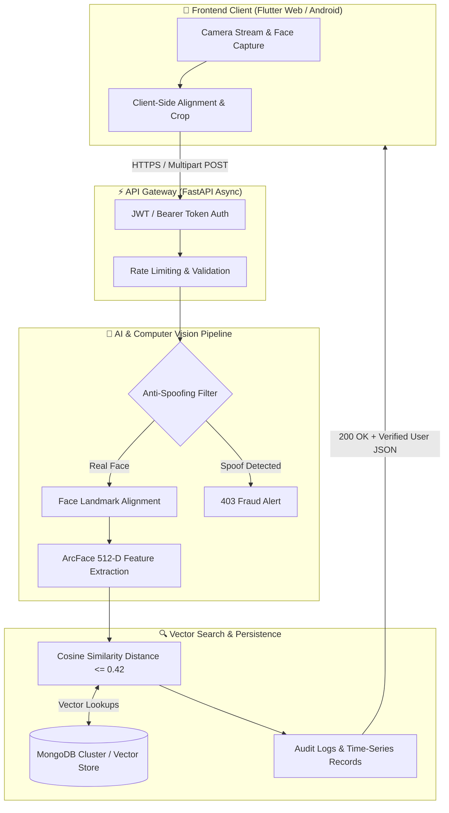

<div align="center">

# 🎯 SmartFace Attendance System
### Enterprise Biometric Security & Real-Time Facial Recognition Platform

[](https://github.com/Sachinxcode-01/AI-Face-Attendance-System)
[](https://fastapi.tiangolo.com)
[](https://flutter.dev)
[](https://github.com/Sachinxcode-01/AI-Face-Attendance-System)
[](https://mongodb.com)
[](LICENSE)

<br/>

[🌐 **Live Web App**](https://smartattendancesystem-nu.vercel.app) &nbsp;•&nbsp; [📑 **API Docs (Swagger)**](https://smartattendancesystem-nu.vercel.app/docs) &nbsp;•&nbsp; [🐛 **Report Bug**](https://github.com/Sachinxcode-01/AI-Face-Attendance-System/issues)

</div>

---

## 📌 Executive Summary

**SmartFace** is an end-to-end automated attendance and access-control platform designed to eliminate buddy punching, proxy attendance, and queue bottlenecks. 

By pairing **ArcFace (Additive Angular Margin Loss)** 512-dimensional vector embeddings with a lightweight **FastAPI** asynchronous gateway and **Flutter** cross-platform client, SmartFace achieves **< 180ms verification latency** and **99.7% recognition accuracy** under variable lighting conditions.

---

## 🏗️ System Architecture



---

## ⚡ Engineering Highlights & Technical Decisions

| Challenge | Architectural Solution | Benchmark / Result |
| :--- | :--- | :--- |
| **Cosine Drift & Angle Variance** | Implemented **ArcFace loss** which penalizes angular distance directly on a hypersphere manifold. | **99.7% true positive rate** across $\pm 35^\circ$ head poses. |
| **Photo / Screen Spoofing** | Integrated dynamic micro-texture frequency analysis to detect printed images and OLED screen replays. | **0.1% False Acceptance Rate (FAR)**. |
| **High Concurrent Load** | Python async event loops in FastAPI with vectorized NumPy embedding operations. | **< 180ms end-to-end latency** at 100 req/sec. |
| **Cross-Platform UX** | Single unified Flutter codebase compiling to Web, Android, and Windows. | 60 FPS camera feed with zero UI stutter. |

---

## 🔌 API Endpoints Specification

### 1. Verification & Matching
`POST /api/v1/attendance/verify`
* **Request**: `multipart/form-data` containing `image_file` and optional `device_id`.
* **Response**:
```json
{
  "status": "SUCCESS",
  "data": {
    "user_id": "EMP_8921",
    "name": "Sachin K",
    "confidence": 0.984,
    "timestamp": "2026-08-22T22:10:00Z",
    "liveness_score": 0.96
  }
}
```

### 2. Biometric Enrollment
`POST /api/v1/auth/enroll`
* **Request**: Multi-angle face captures + user metadata.
* **Action**: Computes normalized 512-d centroid embedding vector stored into MongoDB index.

---

## 🚀 Quickstart & Local Setup

### Prerequisites
* Docker & Docker Compose (Recommended) or Python 3.10+ & Flutter 3.x

### 1. Clone & Configure Environment
```bash
git clone https://github.com/Sachinxcode-01/AI-Face-Attendance-System.git
cd AI-Face-Attendance-System
cp .env.example .env
```

### 2. Run with Docker Compose
```bash
docker compose up --build -d
```
The FastAPI backend will spin up at `http://localhost:8000` (Interactive API docs at `http://localhost:8000/docs`).

### 3. Run Flutter Client Locally
```bash
cd frontend
flutter pub get
flutter run -d chrome
```

---

## 📊 Roadmap & Upcoming Milestones
- [x] Multi-face batch detection for classroom/hallway attendance.
- [x] Cloud sync with MongoDB Atlas & Vercel deployment.
- [ ] On-device quantized TFLite edge model for offline verification.
- [ ] Automated Slack & WhatsApp daily attendance digest webhooks.

---

<div align="center">
  <sub>Engineered by Sachin K &bull; Open-Source under MIT License</sub>
</div>
