<!-- ══════════════════════ HEADER ══════════════════════ -->

<a href="https://github.com/Sachinxcode-01">
  
</a>

<h1 align="center">
  
  Hey, I'm Sachin
</h1>

<p align="center">
  <a href="https://git.io/typing-svg">
    
  </a>
</p>

<p align="center">
  <a href="https://www.linkedin.com/in/sachin-k-5b6689322"></a>
  <a href="mailto:kalinganavarsachin@gmail.com"></a>
  <a href="https://www.instagram.com/ohh_itz_sachin_"></a>
  <a href="https://www.facebook.com/share/18G1CnZ183/"></a>
  
</p>

<!-- ══════════════════════ ABOUT ══════════════════════ -->


##  &nbsp;About Me

```typescript
const sachin: Developer = {
  role:      "Full Stack Developer (MERN) + AI & Mobile",
  location:  "India 🇮🇳",
  education: "B.Tech — Computer Science & Engineering",
  title:     "Google Student Ambassador 2026",

  currentlyBuilding: ["Smart Attendance System (AI Face Recognition)",
                      "School Web Portal", "Full-Stack MERN Products"],
  learning:          ["Scalable Architecture", "DSA", "Advanced Backend", "AI Integrations"],
  askMeAbout:        ["MERN Stack", "FastAPI", "Flutter", "Git & GitHub", "Hackathons"],

  philosophy: "Learn by doing, grow by building, turn ideas into real products.",
};
```

- 🔭 &nbsp;Currently engineering a **Smart Attendance Management System** with **AI face recognition**, plus full-stack **MERN** products.
- 🌱 &nbsp;Leveling up in **MERN**, **Flutter**, **AI tooling**, and **Data Structures & Algorithms**.
- 🤝 &nbsp;Open to **open-source collaboration**, **internships**, and **scalable backend** challenges.
- 💬 &nbsp;Ask me about **web development**, **FastAPI**, **mobile apps**, or **student hackathons**.
- 📫 &nbsp;Reach me at **[kalinganavarsachin@gmail.com](mailto:kalinganavarsachin@gmail.com)**
- ⚡ &nbsp;Fun fact: I believe the best way to learn is to **ship something real**.

<br/>

<table>
  <tr>
    <td width="50%" valign="middle" align="center">
      
    </td>
    <td width="50%" valign="middle" align="center">
      
    </td>
  </tr>
</table>

<!-- ══════════════════════ TECH ARSENAL ══════════════════════ -->


## 🧰 &nbsp;Tech Arsenal

> The complete toolkit I've used to design, build, and ship my projects.

<table>
  <tr>
    <td valign="top" width="33%">
      <h3 align="center">💻 Languages</h3>
      <p align="center">
        
        
        
        
        
        
      </p>
    </td>
    <td valign="top" width="33%">
      <h3 align="center">🎨 Frontend</h3>
      <p align="center">
        
        
        
        
      </p>
    </td>
    <td valign="top" width="33%">
      <h3 align="center">⚙️ Backend</h3>
      <p align="center">
        
        
        
        
      </p>
    </td>
  </tr>
  <tr>
    <td valign="top" width="33%">
      <h3 align="center">🤖 AI / ML &amp; Vision</h3>
      <p align="center">
        
        
        
        
      </p>
    </td>
    <td valign="top" width="33%">
      <h3 align="center">🗄️ Database &amp; Mobile</h3>
      <p align="center">
        
        
        
      </p>
    </td>
    <td valign="top" width="33%">
      <h3 align="center">🛠️ Dev Tools</h3>
      <p align="center">
        
        
        
        
        
      </p>
    </td>
  </tr>
</table>

<!-- ══════════════════════ TECH ORBIT ══════════════════════ -->


## 🌌 &nbsp;Tech Stack Orbit

<p align="center">
  
</p>

<!-- ══════════════════════ SKILLS ══════════════════════ -->

## 🎯 &nbsp;Skills &amp; Proficiency

<p align="center">
  
</p>

<!-- ══════════════════════ PROJECTS ══════════════════════ -->


## 🚀 &nbsp;Featured Projects

<details open>
  <summary><b>🤖 SmartFace — AI Smart Attendance Management System</b></summary>
  <br/>

  A full-stack platform that automates attendance using **AI facial recognition**, spanning a **FastAPI** vision backend, a **MERN** admin dashboard, and a **Flutter** companion app.

  - **AI Face Recognition** &mdash; **ArcFace** embeddings with cosine-similarity matching for real-time, proxy-proof check-ins from a live camera feed.
  - **Mobile Onboarding** &mdash; teachers capture/upload student faces from the Flutter app; images auto-organize into the training dataset and trigger background model re-training.
  - **Admin Dashboard** &mdash; real-time charts, monthly reports, and PDF/Excel export.
  - **Smart Alerts** &mdash; automated low-attendance emails, intruder detection, and push notifications.
  - **Integrations** &mdash; attendance synced to **Google Sheets** in real time.

  <p>
    
    
    
    
    
    
    
    
    
  </p>
</details>

<details>
  <summary><b>🌐 Responsive School Website</b></summary>
  <br/>

  A modern, mobile-first portal for academic institutions with online admissions, a dynamic notice board, and a responsive media gallery.

  - **Admissions Portal** &mdash; custom enrollment request forms.
  - **Dynamic Notice Board** &mdash; holidays, exam updates, and events at a glance.
  - **Media Gallery** &mdash; responsive carousel showcasing campus life and achievements.

  <p>
    
    
    
    
    
  </p>
</details>

<!-- ══════════════════════ DEV JOURNEY ══════════════════════ -->


## 🌠 &nbsp;My Dev Journey

<p align="center">
  
</p>

<!-- ══════════════════════ GITHUB STATS ══════════════════════ -->


## 📊 &nbsp;GitHub Analytics

<div align="center">

  

  <table border="0">
    <tr>
      <td align="center" valign="middle">
        
      </td>
      <td align="center" valign="middle">
        
      </td>
      <td align="center" valign="middle">
        
      </td>
    </tr>
    <tr>
      <td align="center" valign="middle" colspan="2">
        
      </td>
      <td align="center" valign="middle">
        
      </td>
    </tr>
  </table>

  <a href="https://github.com/ryo-ma/github-profile-trophy">
    
  </a>

</div>

## 📈 &nbsp;Contribution Graph


## 🐍 &nbsp;Contribution Snake

<picture>
  <source media="(prefers-color-scheme: dark)" srcset="https://raw.githubusercontent.com/Sachinxcode-01/Sachinxcode-01/output/github-snake-dark.svg" />
  <source media="(prefers-color-scheme: light)" srcset="https://raw.githubusercontent.com/Sachinxcode-01/Sachinxcode-01/output/github-snake.svg" />
  
</picture>

<!-- ══════════════════════ FOOTER ══════════════════════ -->


<div align="center">

### 🤝 &nbsp;Let's Connect &amp; Build Something Amazing

<a href="https://www.linkedin.com/in/sachin-k-5b6689322"></a>
<a href="mailto:kalinganavarsachin@gmail.com"></a>
<a href="https://www.instagram.com/ohh_itz_sachin_"></a>
<a href="https://github.com/Sachinxcode-01"></a>

<br/><br/>


<i>⭐ From <a href="https://github.com/Sachinxcode-01">Sachinxcode-01</a> — building ideas into reality, one commit at a time.</i>

</div>
