<h1 align="center">Hi there, I'm Sachin! </h1>

  

  

---

## About Me

- 🔭 I'm currently working on **Smart Attendance Management System,
  School Website, and Full Stack MERN Projects.**
- 🌱 I'm currently learning **MERN Stack Development, Flutter App Development,
  AI Tools & Integrations, and DSA.**
- 🤝 I'm looking for help with **Open Source Contributions,
  Advanced Backend Development, Internships, and Scalable Architecture.**
- 💬 Ask me about **MERN Stack, Web Development, Git & GitHub,
  Student Projects, Hackathons, and AI Tools.**
- 📫 How to reach me: **[kalinganavarsachin@gmail.com](mailto:kalinganavarsachin@gmail.com)**
- ⚡ Fun fact: **I believe in learning by doing, growing by building, and turning ideas into real-world products.**

<table border="0">
  <tr>
    <td width="50%" valign="middle" align="center">
      
    </td>
    <td width="50%" valign="middle" align="center">
      
    </td>
  </tr>
</table>

## Socials

## Languages And Tools

<table>
  <tr>
    <td valign="top" width="50%">
      <h3>💻 Programming Languages</h3>
      
      
      
    </td>
    <td valign="top" width="50%">
      <h3>🚀 Frontend Development</h3>
      
      
      
    </td>
  </tr>
  <tr>
    <td valign="top" width="50%">
      <h3>⚙️ Backend & Database</h3>
      
      
      
    </td>
    <td valign="top" width="50%">
      <h3>🛠️ Mobile & Dev Tools</h3>
      
      
      
    </td>
  </tr>
</table>

## 🎯 Skills & Proficiency

  

## 🚀 Highlighted Projects

  
<b>🛠️ Smart Attendance Management System (MERN Stack)</b>

   
  
  A full-stack web application designed to digitize and automate the traditional process of tracking and recording attendance.
  
  *   **Key Features**:
      *   **Biometric / Dynamic QR Attendance**: Generates secure, short-lived QR codes to prevent proxy student check-ins.
      *   **Admin Dashboard**: Real-time charts, monthly reports, and data exportation (PDF/Excel) for teachers.
      *   **Automated Email Warnings**: Notifies users and parents when attendance falls below standard percentages.
  *   **Tech Stack**: MongoDB, Express.js, React, Node.js, TailwindCSS.

  
<b>🌐 Responsive School Website</b>

   
  
  A modern, user-friendly portal for academic institutions offering online admissions, event notices, and responsive navigation.
  
  *   **Key Features**:
      *   **Admissions Portal**: Custom forms for student enrollment requests.
      *   **Dynamic Notice Board**: High-impact notice section displaying holiday listings, exam updates, and events.
      *   **Media Gallery**: Responsive carousel to showcase school achievements and campus life.
  *   **Tech Stack**: HTML5, CSS3, JavaScript (ES6+), Bootstrap, Node.js.

## 🌌 My Dev Journey

  

## 📊 GitHub Dashboard

  

  <table border="0">
    <tr>
      <td align="center" valign="middle">
        
      </td>
      <td align="center" valign="middle">
        
      </td>
      <td align="center" valign="middle">
        
      </td>
    </tr>
    <tr>
      <td align="center" valign="middle" colspan="2">
        
      </td>
      <td align="center" valign="middle">
         
        
      </td>
    </tr>
  </table>

  

## 📈 Contribution Graph

## 🐍 Contribution Snake

<picture>
  <source media="(prefers-color-scheme: dark)" srcset="https://raw.githubusercontent.com/Sachinxcode-01/Sachinxcode-01/output/github-snake-dark.svg" />
  <source media="(prefers-color-scheme: light)" srcset="https://raw.githubusercontent.com/Sachinxcode-01/Sachinxcode-01/output/github-snake.svg" />
  
</picture>

---

### 🤝 Let's Connect & Build Something Amazing!

 

