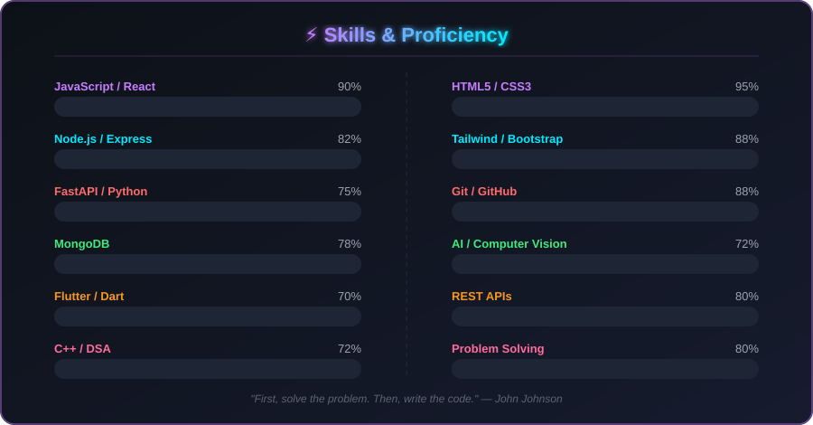
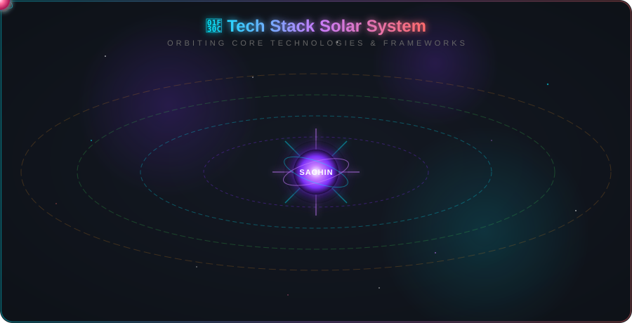
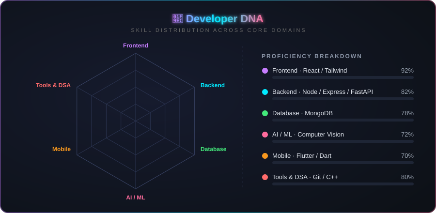
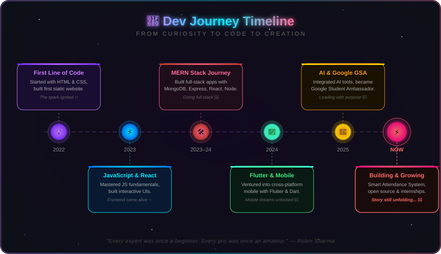

<div align="center">

<!-- ░░░░░░░░░░░░░░░░ MATRIX HEADER ░░░░░░░░░░░░░░░░ -->

<picture>
  <source media="(prefers-color-scheme: dark)" srcset="./banner_dark.svg">
  <source media="(prefers-color-scheme: light)" srcset="./banner_light.svg">
  
</picture>

<br/>

<!-- Glitch-style name -->
<a href="https://github.com/Sachinxcode-01">
  
</a>

<!-- Animated typing -->
<a href="https://git.io/typing-svg">
  
</a>

<br/><br/>

<!-- Status badges row -->

&nbsp;

&nbsp;

&nbsp;


<br/><br/>

<!-- Social Links — glowing style -->
<a href="https://www.linkedin.com/in/sachin-k-5b6689322">
  
</a>&nbsp;
<a href="mailto:kalinganavarsachin@gmail.com">
  
</a>&nbsp;
<a href="https://www.instagram.com/ohh_itz_sachin_">
  
</a>&nbsp;
<a href="https://github.com/Sachinxcode-01">
  
</a>&nbsp;
<a href="https://www.facebook.com/share/18G1CnZ183/">
  
</a>

</div>

<br/>

<!-- ░░░░░░░░░░ NAVIGATION ░░░░░░░░░░ -->
<div align="center">

[`⚡ About`](#-about-me) &nbsp;·&nbsp; [`🛠 Stack`](#%EF%B8%8F-tech-arsenal) &nbsp;·&nbsp; [`🚀 Projects`](#-featured-projects) &nbsp;·&nbsp; [`📊 Stats`](#-github-analytics) &nbsp;·&nbsp; [`🔗 Connect`](#-lets-connect)

</div>


<!-- ░░░░░░░░░░░░░░░░ ABOUT ░░░░░░░░░░░░░░░░ -->

## ⚡ About Me

<div align="center">

```ascii
╔═══════════════════════════════════════════════════════════════════════════════╗
║                                                                               ║
║   ███████╗ █████╗  ██████╗██╗  ██╗██╗███╗   ██╗    ██╗  ██╗                ║
║   ██╔════╝██╔══██╗██╔════╝██║  ██║██║████╗  ██║    ██║ ██╔╝                ║
║   ███████╗███████║██║     ███████║██║██╔██╗ ██║    █████╔╝                 ║
║   ╚════██║██╔══██║██║     ██╔══██║██║██║╚██╗██║    ██╔═██╗                 ║
║   ███████║██║  ██║╚██████╗██║  ██║██║██║ ╚████║    ██║  ██╗                ║
║   ╚══════╝╚═╝  ╚═╝ ╚═════╝╚═╝  ╚═╝╚═╝╚═╝  ╚═══╝    ╚═╝  ╚═╝                ║
║                                                                               ║
║   ┌─────────────────────────────────────────────────────────────────────┐   ║
║   │  ROLE        : Full Stack Developer & AI Engineer                  │   ║
║   │  EDUCATION   : B.Tech — Computer Science & Engineering             │   ║
║   │  TITLE       : Google Student Ambassador 2026                      │   ║
║   │  LOCATION    : India 🇮🇳                                            │   ║
║   │  EMAIL       : kalinganavarsachin@gmail.com                        │   ║
║   └─────────────────────────────────────────────────────────────────────┘   ║
║                                                                               ║
╚═══════════════════════════════════════════════════════════════════════════════╝
```

</div>

<br/>

<table>
<tr>
<td width="50%" valign="top">

```python
#!/usr/bin/env python3
# ╔════════════════════════════════════╗
# ║   SACHIN.exe — Developer Profile  ║
# ╚════════════════════════════════════╝

class Sachin:
    def __init__(self):
        self.name = "Sachin K"
        self.role = "Full Stack Developer"
        self.location = "India 🇮🇳"
        
    @property
    def stack(self):
        return {
            "frontend": [
                "React", 
                "Tailwind CSS", 
                "HTML5/CSS3"
            ],
            "backend": [
                "Node.js", 
                "Express", 
                "FastAPI"
            ],
            "mobile": [
                "Flutter", 
                "Dart"
            ],
            "ai_ml": [
                "OpenCV", 
                "ArcFace", 
                "Computer Vision"
            ],
            "database": [
                "MongoDB", 
                "Google Sheets API"
            ],
            "languages": [
                "JavaScript", 
                "Python", 
                "C++", 
                "Dart"
            ]
        }
    
    @property
    def current_projects(self):
        return [
            "🤖 SmartFace — AI Attendance",
            "🏫 School Web Portal (MERN)",
            "📱 Flutter Mobile Apps"
        ]
    
    @property
    def learning_now(self):
        return [
            "⚡ System Architecture",
            "🧠 Advanced AI",
            "📚 DSA & Algorithms"
        ]
    
    def philosophy(self):
        return """
        ┌─────────────────────────────────┐
        │  Learn by doing.                │
        │  Grow by building.              │
        │  Ship something real.           │
        └─────────────────────────────────┘
        """
    
    def say_hi(self):
        ascii_art = r"""
        
    ╔═══════════════════════════════╗
    ║  Hey! Let's build something   ║
    ║  amazing together 🚀          ║
    ╚═══════════════════════════════╝
        """
        print(ascii_art)

# Initialize
>>> dev = Sachin()
>>> dev.say_hi()
>>> print(dev.philosophy())
>>> print(f"Currently: {dev.current_projects}")
```

</td>
<td width="50%" valign="top">

<br/>

```ascii
    ╔════════════════════════════════╗
    ║   SYSTEM STATUS: ONLINE ✓     ║
    ╚════════════════════════════════╝

     ┌───────────────────────────────┐
     │   📊 PROGRESS DASHBOARD       │
     ├───────────────────────────────┤
     │                               │
     │   Frontend   ████████░░  80%  │
     │   Backend    ██████████  95%  │
     │   Mobile     ███████░░░  70%  │
     │   AI/ML      ████████░░  85%  │
     │   Database   █████████░  90%  │
     │   DevOps     ████░░░░░░  40%  │
     │                               │
     └───────────────────────────────┘

     ┌───────────────────────────────┐
     │  🎯 CURRENT OBJECTIVES        │
     ├───────────────────────────────┤
     │  [█████████░] SmartFace v1.0  │
     │  [████████░░] School Portal   │
     │  [███████░░░] Flutter App     │
     │  [█████░░░░░] DSA Mastery     │
     └───────────────────────────────┘

     ┌───────────────────────────────┐
     │  📡 AVAILABILITY STATUS       │
     ├───────────────────────────────┤
     │  ● Internships    : OPEN      │
     │  ● Freelance      : OPEN      │
     │  ● Collaboration  : OPEN      │
     │  ● Hackathons     : ACTIVE    │
     └───────────────────────────────┘

     ┌───────────────────────────────┐
     │  ⚡ QUICK STATS                │
     ├───────────────────────────────┤
     │  Languages:        6+         │
     │  Frameworks:       10+        │
     │  Projects:         15+        │
     │  Coffee Consumed:  ∞          │
     └───────────────────────────────┘
```

</td>
</tr>
</table>

<br clear="right"/>

<div align="center">

```
╔══════════════════════════════════════════════════════════════════════════════╗
║                        ⚡  DEVELOPER  TERMINAL  ⚡                          ║
╠══════════════════════════════════════════════════════════════════════════════╣
║  C:\SACHIN> whoami                                                           ║
║  > Full Stack Developer & AI Engineer                                        ║
║                                                                              ║
║  C:\SACHIN> cat currently_building.txt                                       ║
║  > SmartFace — AI face-recognition attendance system                         ║
║  > School Web Portal (full-stack MERN)                                       ║
║  > Flutter Companion Mobile App                                              ║
║                                                                              ║
║  C:\SACHIN> cat learning.log                                                 ║
║  > Scalable Architecture  |  Advanced Backend  |  DSA  |  AI Integrations   ║
║                                                                              ║
║  C:\SACHIN> cat open_for.txt                                                 ║
║  > Internships  |  Open-Source  |  Freelance  |  Hackathons                 ║
║                                                                              ║
║  C:\SACHIN> cat fun_fact.txt                                                 ║
║  > I debug with console.log() and I have zero regrets.                       ║
║                                                                              ║
║  C:\SACHIN> cat ask_me_about.txt                                             ║
║  > MERN Stack  |  FastAPI  |  Flutter  |  Git  |  Hackathons  |  AI/CV      ║
║                                                                              ║
║  C:\SACHIN> _                                                                ║
╚══════════════════════════════════════════════════════════════════════════════╝
```

</div>

<br/>

<!-- Joke card -->
<div align="center">
  
</div>


<!-- ░░░░░░░░░░░░░░░░ TECH ARSENAL ░░░░░░░░░░░░░░░░ -->

## 🛠️ Tech Arsenal

<div align="center">

<!-- Languages -->
### 💻 Languages


</div>

<br/>

<div align="center">

<table>
<tr>
<td align="center" width="200">

**🎨 Frontend**


</td>
<td align="center" width="200">

**⚙️ Backend**


</td>
<td align="center" width="200">

**🤖 AI / ML & Vision**


</td>
</tr>
<tr>
<td align="center" width="200">

**🗄️ Database**


</td>
<td align="center" width="200">

**📱 Mobile**


</td>
<td align="center" width="200">

**🔧 Dev Tools**


</td>
</tr>
</table>

</div>

<br/>

<!-- ══ Skill Bars ══ -->
<div align="center">
  
</div>

<br/>

<!-- ══ Tech Orbit ══ -->
<div align="center">
  
</div>

<br/>

<!-- ══ Developer DNA Radar ══ -->
<div align="center">
  
</div>


<!-- ░░░░░░░░░░░░░░░░ PROJECTS ░░░░░░░░░░░░░░░░ -->

## 🚀 Featured Projects

<!-- ═══ SmartFace ═══ -->
<details open>
<summary>
<h3>🤖 SmartFace — AI Smart Attendance Management System</h3>
</summary>

<br/>

> A production-grade, full-stack AI attendance platform using **facial recognition** — spanning a **FastAPI** vision backend, **MERN** admin dashboard, and a **Flutter** mobile companion app.

<div align="center">

```
┌─────────────────────────────────────────────────────────────────────┐
│                    SMARTFACE ARCHITECTURE                           │
│                                                                     │
│  📱 Flutter App          🌐 React Dashboard       🎥 Live Camera   │
│       │                        │                       │            │
│       └────────────────────────┼───────────────────────┘            │
│                                ↓                                    │
│                    ⚡ FastAPI Backend                               │
│                         │        │                                  │
│              🧠 ArcFace AI    🗄️ MongoDB                          │
│                   │                │                                │
│         Face Embeddings     Student Records                         │
│                   │                │                                │
│              ✅ Present     📊 Google Sheets Sync                  │
└─────────────────────────────────────────────────────────────────────┘
```

</div>

**Key Features:**

| Feature | Description |
|--------|-------------|
| 🧠 **AI Face Recognition** | ArcFace embeddings + cosine-similarity — proxy-proof real-time check-ins |
| 📱 **Mobile Onboarding** | Teachers capture/upload student faces; auto-triggers background AI re-training |
| 📊 **Admin Dashboard** | Real-time charts, monthly reports, PDF/Excel exports |
| 🔔 **Smart Alerts** | Low-attendance emails, intruder detection, push notifications |
| 🔄 **Google Sheets Sync** | Attendance synced to Google Sheets in real time |

<p>
  
  
  
  
  
  
  
  
</p>

</details>

<br/>

<!-- ═══ School Website ═══ -->
<details>
<summary>
<h3>🌐 Responsive School Web Portal</h3>
</summary>

<br/>

> A modern, mobile-first portal for academic institutions with online admissions, a dynamic notice board, and a responsive media gallery.

**Key Features:**

| Feature | Description |
|--------|-------------|
| 📝 **Admissions Portal** | Custom enrollment forms with validation |
| 📌 **Dynamic Notice Board** | Holidays, exam updates, and events at a glance |
| 🖼️ **Media Gallery** | Responsive carousel showcasing campus life |
| 📱 **Mobile-First Design** | Fully responsive across all screen sizes |

<p>
  
  
  
  
  
</p>

</details>

<br/>

<div align="center">
  <a href="https://github.com/Sachinxcode-01?tab=repositories">
    
  </a>
</div>


<!-- ░░░░░░░░░░░░░░░░ DEV JOURNEY ░░░░░░░░░░░░░░░░ -->

## 🌟 Dev Journey

<div align="center">
  
</div>


<!-- ░░░░░░░░░░░░░░░░ GITHUB STATS ░░░░░░░░░░░░░░░░ -->

## 📊 GitHub Analytics

<div align="center">

<!-- Profile summary card full-width -->


<br/><br/>

<!-- Stats + Languages side by side -->

&nbsp;&nbsp;


<br/><br/>

<!-- Streak -->


<br/><br/>

<!-- Productive time -->

&nbsp;


<br/><br/>

<!-- Trophies -->
<a href="https://github.com/ryo-ma/github-profile-trophy">
  
</a>

</div>

<br/>

## 📈 Contribution Graph

<div align="center">
  
</div>

<br/>

## 🐍 Contribution Snake

<div align="center">
  <picture>
    <source media="(prefers-color-scheme: dark)" srcset="https://raw.githubusercontent.com/Sachinxcode-01/Sachinxcode-01/output/github-snake-dark.svg"/>
    <source media="(prefers-color-scheme: light)" srcset="https://raw.githubusercontent.com/Sachinxcode-01/Sachinxcode-01/output/github-snake.svg"/>
    
  </picture>
</div>


<!-- ░░░░░░░░░░░░░░░░ CURRENT STATUS ░░░░░░░░░░░░░░░░ -->

## 🎯 Current Mission

<div align="center">

```
╔══════════════════════════════════════════════════════════════════════════════╗
║                       🎯  MISSION CONTROL  —  2026                         ║
╠══════════════════════════════════════════════════════════════════════════════╣
║                                                                              ║
║   OBJECTIVE                      STATUS          PRIORITY                   ║
║   ─────────────────────────────────────────────────────────                 ║
║   🤖 Ship SmartFace v1.0          IN PROGRESS     ██████████  CRITICAL       ║
║   🏫 Launch School Web Portal     IN PROGRESS     ████████░░  HIGH           ║
║   📱 Publish on Play Store        PLANNING        ██████░░░░  HIGH           ║
║   📚 Master DSA & System Design   ONGOING         █████░░░░░  MEDIUM         ║
║   🌐 Land a meaningful internship OPEN            ████████░░  CRITICAL       ║
║   🏆 Win a national hackathon     UPCOMING        ███░░░░░░░  MEDIUM         ║
║                                                                              ║
╠══════════════════════════════════════════════════════════════════════════════╣
║                                                                              ║
║  ┌──────────────────────────────────────────────────────────────────────┐   ║
║  │  SMARTFACE SYSTEM STATUS                                             │   ║
║  │                                                                      │   ║
║  │  FastAPI Backend     ████████████████████  100%  ✓ DONE              │   ║
║  │  ArcFace AI Model    ████████████████████  100%  ✓ DONE              │   ║
║  │  React Dashboard     ████████████████░░░░   80%  🔄 IN PROGRESS      │   ║
║  │  Flutter Mobile App  ██████████████░░░░░░   70%  🔄 IN PROGRESS      │   ║
║  │  Google Sheets Sync  ████████████████████  100%  ✓ DONE              │   ║
║  │  Production Deploy   ██░░░░░░░░░░░░░░░░░░   10%  ⏳ UPCOMING         │   ║
║  └──────────────────────────────────────────────────────────────────────┘   ║
║                                                                              ║
╚══════════════════════════════════════════════════════════════════════════════╝
```

</div>

<br/>

<!-- Fun status badges -->
<div align="center">


</div>


<!-- ░░░░░░░░░░░░░░░░ CONNECT ░░░░░░░░░░░░░░░░ -->

## 🤝 Let's Connect

<div align="center">

<br/>

> _"The best way to predict the future is to build it."_

<br/>

I'm always open to interesting projects, internship opportunities, or just a good tech conversation.  
**Drop a message — let's build something great together!**

<br/>

<a href="https://www.linkedin.com/in/sachin-k-5b6689322">
  
</a>&nbsp;
<a href="mailto:kalinganavarsachin@gmail.com">
  
</a>&nbsp;
<a href="https://www.instagram.com/ohh_itz_sachin_">
  
</a>&nbsp;
<a href="https://github.com/Sachinxcode-01">
  
</a>

<br/><br/>

<!-- Footer wave -->


<br/>

⭐ **From [Sachinxcode-01](https://github.com/Sachinxcode-01)** — _Building ideas into reality, one commit at a time._

<br/>


</div>
