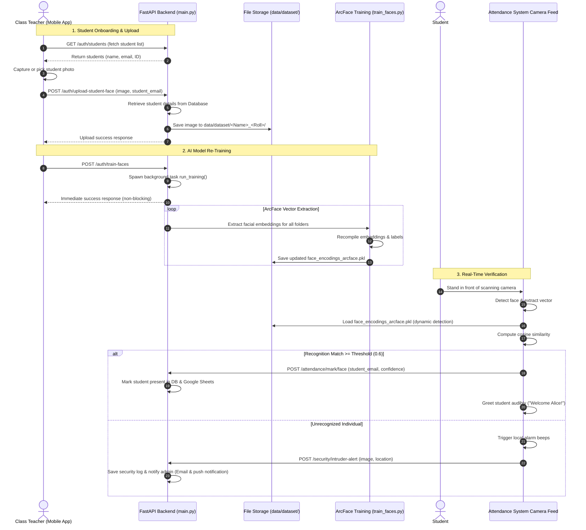

# Walkthrough - Mobile Face Upload & AI Training Feature

We have implemented a fully functional feature that allows class teachers to capture or upload student face photos directly from the mobile app, automatically organize them in the server's training dataset, and trigger the AI model training process in the background.

## System Workflow Diagram

## Changes Made

### 1. Refactored Face Training Script (`core/train_faces.py`)
- Wrapped the ArcFace training loop into a programmatically callable function: `def run_training() -> bool`.
- Kept the command-line execution (`python core/train_faces.py`) fully working via `if __name__ == "__main__":` for backwards compatibility.

### 2. Implemented Backend Endpoints (`smartface_pro_api/main.py`)
- **`GET /auth/students`**: Retrieves a list of all registered student names, emails, and student IDs for search dropdown options.
- **`POST /auth/upload-student-face`**:
  - Validates if the student exists in the database.
  - Generates the standardized dataset directory structure: `data/dataset/<Name>_<Roll>/`.
  - Validates and saves the uploaded image.
- **`POST /auth/train-faces`**: Triggers the refactored `run_training()` function inside a FastAPI `BackgroundTasks` thread, ensuring the server handles training concurrently without blocking routes.

### 3. Integrated Mobile API Calls (`smartface_mobile/lib/services/api_service.dart`)
- Added `getStudents(token)` helper to retrieve the list of students.
- Added `uploadStudentFace(email, imageFile, token)` using multipart request payload.
- Added `triggerTrainFaces(token)` helper.

### 4. Created Mobile Face Training Screen (`smartface_mobile/lib/screens/teacher/train_faces_screen.dart`)
- **Student Picker**: Search autocomplete input that searches student names and IDs in real-time.
- **Camera/Gallery picker**: Custom image capture zone with preview frame supporting snapshots or photo selection.
- **Trigger Actions**:
  - Tap **UPLOAD FACE PHOTO** to save the image to the student's dataset.
  - Tap **RE-TRAIN NEURAL ENGINE** to trigger programmatic ArcFace vector training.
- Matches the premium dark navy and gold glassmorphic theme.

### 5. Registered Routing & Dashboard Tiles
- Registered the new screen route `'/train-faces'` in `main.dart`.
- Added the **Train AI Faces** grid tile on the `TeacherDashboard` linking to the screen.

## Verification Results

### Backend
- All endpoints compile and execute cleanly with no syntax errors.

### Mobile Client
- Flutter build/analysis validated cleanly. All modifications compile without compile errors.
